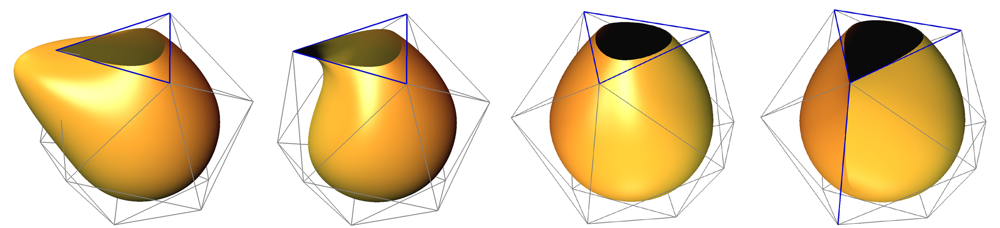
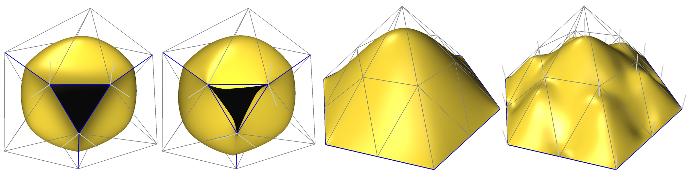
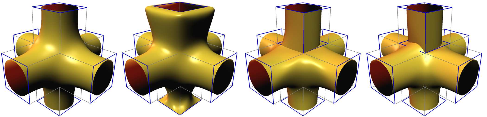

# Subdivide 2.0

This is a **maintained** fork of [Subdivide 2.0](https://cs.nyu.edu/home/people/in_memoriam/biermann/subdivision) from the Media Research Lab at NYU.

It is meant as companion code to the following [paper](doc/piecewise-smooth.pdf):
```
H. Biermann, A. Levin, D. Zorin.
Piecewise smooth subdivision surfaces with normal control.
SIGGRAPH 2000 Conference Proceedings.
```

## Features

### Improvements Made

- **Build System**: Updated to use CMake for better portability
- **Cross-Platform**: Supports Linux, macOS, and Windows
- **Modern C++**: Updated to C++11 standard
- **Modern OpenGL**: Updated to use GLFW and GLM
- **CI/CD**: Automated testing with GitHub Actions
- **Improved Documentation**: Comprehensive build and usage instructions

### Supported Subdivision Types

- **Catmull-Clark** for quadrilateral meshes
- **Loop** for triangular meshes

### Interactive Viewer

- Real-time visualization of subdivision surfaces
- Interactive manipulation of creases, corners, and normals
- Export capabilities for both control and subdivided meshes

### Visual Examples

Complex geometrical features:



Normal interpolation:



Precise surface manipulation at corners:



## Building from Source

- CMake 3.15 or later
- C++17 compatible compiler (GCC 8+, Clang 10+, Apple Clang 12+)
- GLFW (for the viewer application)

### Linux (Ubuntu/Debian)

```bash
# Install dependencies
sudo apt-get update
sudo apt-get install -y cmake libglfw3-dev

# Build
cmake -S . -B build -DCMAKE_BUILD_TYPE=Release
cmake --build build --config Release --parallel
```

### macOS

```bash
# Install dependencies using Homebrew
brew install cmake glfw

# Build
cmake -S . -B build -DCMAKE_BUILD_TYPE=Release
cmake --build build --config Release --parallel
```

### Windows

```bash
# Install dependencies
choco install vcpkg
vcpkg install glfw3:x64-windows

# Build
cmake -S . -B build -DCMAKE_BUILD_TYPE=Release -DCMAKE_TOOLCHAIN_FILE="$env:ChocolateyToolsLocation\vcpkg\scripts\buildsystems\vcpkg.cmake"
cmake --build build --config Release --parallel
```

### Options

- `-DCMAKE_BUILD_TYPE=Release` (default): Optimized release build
- `-DCMAKE_BUILD_TYPE=Debug`: Build with debug symbols

## Usage

### Command Line Tools

#### Catmull-Clark Subdivision (`ccsub`)

```bash
# Show help
./build/bin/ccsub --help

# Subdivide a mesh
./build/bin/ccsub input.wrl -o output.wrl -s 3
```

#### Loop Subdivision (`loopsub`)

```bash
# Show help
./build/bin/loopsub --help

# Subdivide a mesh
./build/bin/loopsub input.wrl -o output.wrl -s 2
```

### Interactive Viewer (`subviewer`)

```bash
# Launch the viewer
./build/bin/subviewer [input.wrl]
```

#### Viewer Controls

- **Left Mouse Button**: Rotate view
- **Middle Mouse Button**: Pan view
- **Right Mouse Button**: Zoom in/out
- **Space**: Toggle control mode between `move`/`pick`
  - `move`: Drag to change view orientation
  - `pick`: Click to toggle mesh entity tags
    - Edge tags: `smooth`/`crease`
    - Boundary vertex tags: `crease`/`corner`
- **S**: Increase subdivision depth
- **W**: Write control mesh to file
- **D**: Write subdivided mesh to file

## Contributing

Contributions are welcome! Please feel free to submit issues and pull requests.

## License

This project is licensed under the [GNU GPLv2](LICENSE).

## Acknowledgments

- Original work by H. Biermann, A. Levin, and D. Zorin
- Initial maintenance work by Máté J Kovács
- Maintained by the open source community
